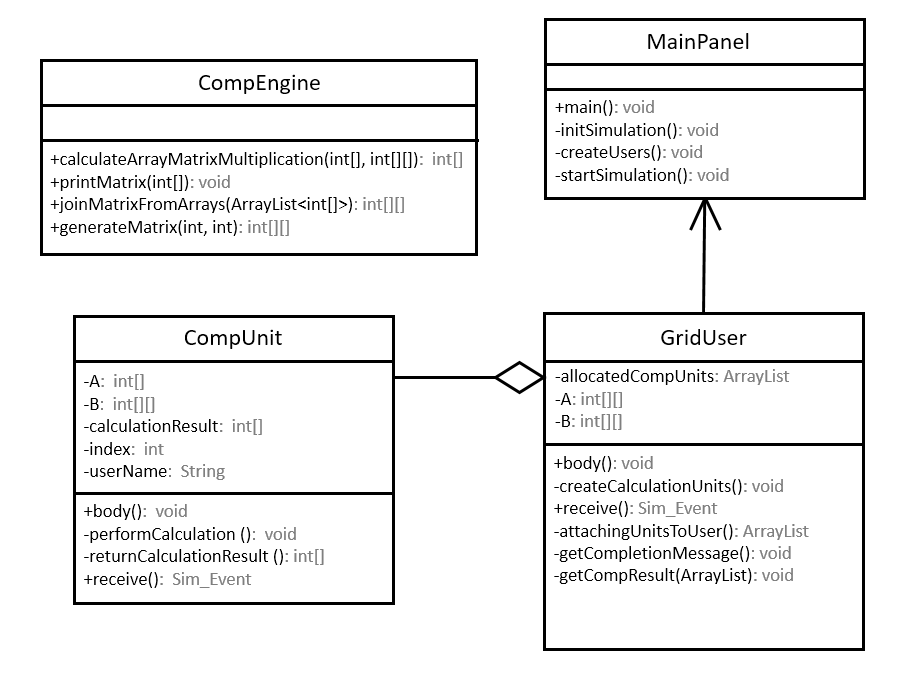

# Distributed calculation simulation using [GridSim](https://simgrid.org/)

## Description
A school assignment where we were tasked with loosely simulating the calculation of the multiplication of two matrices on a distributed system

## SimGrid [🔗](https://simgrid.org/)
A framework for developing simulators of distributed applications that executed on distributed platforms, which can in turn be used to prototype, evaluate and compare relevant platform configurations, system designs, and algorithmic approaches.

## UML Diagram


## Output sample
For 10x10 matrices

<details><summary>Output</summary>
<p>

```
Initialising...
Starting GridSim version 5.0
Entities started.

Creating the calculation units:

[unit0 of user1] is being created
[unit1 of user1] is being created
[unit2 of user1] is being created
[unit3 of user1] is being created
[unit4 of user1] is being created
[unit5 of user1] is being created
[unit6 of user1] is being created
[unit7 of user1] is being created
[unit8 of user1] is being created
[unit9 of user1] is being created

Attaching the created units to the user:

Adding: linkuser1_0
Adding: unit0
Adding: linkuser1_1
Adding: unit1
Adding: linkuser1_2
Adding: unit2
Adding: linkuser1_3
Adding: unit3
Adding: linkuser1_4
Adding: unit4
Adding: linkuser1_5
Adding: unit5
Adding: linkuser1_6
Adding: unit6
Adding: linkuser1_7
Adding: unit7
Adding: linkuser1_8
Adding: unit8
Adding: linkuser1_9
Adding: unit9

Ordering the units to start performing the calculations:
[unit0 of user1] is performing its calculation
[unit4 of user1] is performing its calculation
[unit6 of user1] is performing its calculation
[unit9 of user1] is performing its calculation
[unit7 of user1] is performing its calculation
[unit3 of user1] is performing its calculation
[unit2 of user1] is performing its calculation
[unit1 of user1] is performing its calculation
[unit8 of user1] is performing its calculation
[unit5 of user1] is performing its calculation
[unit0 of user1] completed calculation and array 1 is ready
[unit4 of user1] completed calculation and array 5 is ready
[unit6 of user1] completed calculation and array 7 is ready
[unit9 of user1] completed calculation and array 10 is ready
[unit7 of user1] completed calculation and array 8 is ready
[unit3 of user1] completed calculation and array 4 is ready
[unit2 of user1] completed calculation and array 3 is ready
[unit1 of user1] completed calculation and array 2 is ready
[unit8 of user1] completed calculation and array 9 is ready
[unit5 of user1] completed calculation and array 6 is ready
Sim_system: No more future events
Gathering simulation data.

Final result:
682 1105 910 906 939 724 1071 807 1071 477 
914 1267 910 951 1099 1025 1274 987 1330 667 
693 983 796 943 821 891 888 770 1487 702 
660 661 720 505 646 348 702 511 804 314 
585 978 583 799 907 911 954 730 1216 468 
578 958 580 816 690 641 663 640 1178 432 
847 1080 727 835 1064 875 1156 933 1434 529 
607 1153 853 874 947 928 1058 901 998 515 
625 962 628 744 622 547 688 631 1084 362 
964 1563 1133 1212 1227 999 1283 909 1466 567 

Simulation completed.
```
</p>
</details>


## Future enhancements
* Use Link class provided by SimGrid to transfer the data to the computing units
* File reading